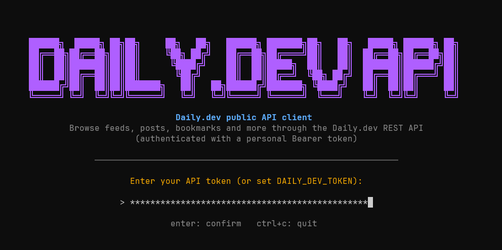

<p align="center">
  
</p>

---

<p align="center">
  <a href="https://github.com/F4NT0/daily-dev-tui/actions/workflows/test.yml"></a>
</p>

<p align="center">
  
  
  
  
  
  
  
  
</p>

---

## Overview

A terminal UI (TUI) for the [Daily.dev](https://app.daily.dev) public API. Browse feeds, search posts, manage bookmarks, and explore developer content directly from your terminal. Written in Go with [Bubble Tea](https://github.com/charmbracelet/bubbletea).

### Technologies

- **Go 1.26+** – Runtime and build tool
- **Daily.dev API token** – Authentication (requires Daily.dev Plus)
- **Windows / Linux / macOS** – Installers and `daily-dev` command (TUI itself is cross-platform)

---

A terminal toolkit for the [Daily.dev](https://app.daily.dev) public API, written in Go with [Bubble Tea](https://github.com/charmbracelet/bubbletea).

## Repository layout

| Path | What it is |
|------|------------|
| `daily-dev-tui/` | The TUI client. Shows a token login screen, then a menu of API requests, parameter forms and a formatted JSON viewer. |
| `daily-dev-tui/main.go` | Bubble Tea model: states (token, menu, form, loading), key handling and layout. |
| `daily-dev-tui/api.go` | HTTP client. Sends `GET` requests to `https://api.daily.dev/public/v1` with `Authorization: Bearer <token>`. |
| `daily-dev-tui/endpoints.go` | The list of supported API requests, with their path/query parameters. |
| `daily-dev-tui/render.go` | Styles and rendering of API responses (posts, tags, sources, ...). |
| `daily-dev-tui/splash.go` | The purple ASCII "DAILY.DEV API" login screen. |
| `daily-dev-installer/` | Windows installer. Fetches or builds the TUI binary, installs it and registers the `daily-dev` command. |
| `daily-dev-installer/help.go` | The colored, tabbed `daily-dev --help` documentation. |
| `daily-dev-installer/install.go` | Install steps: copy files, add the install directory to the user `PATH`. |
| `daily_dev_search.py`, `requirements.txt` | Standalone Python search script. |

## Requirements

- Go 1.26+
- A Daily.dev API token (see below)
- Windows for the installer (the TUI itself is plain Go)

## Getting an API token

1. Sign in at <https://app.daily.dev>.
2. Open your account settings and find the API / Developers section.
3. Create a token and copy it immediately. API access may require Daily.dev Plus.

Keep the token secret and revoke it if it leaks.

## Signing in

The start screen lets you choose between two login methods (`↑/↓` to select, `Enter` to confirm, `Esc` to go back):

### 1. Bearer token (personal access token)

Paste your personal access token (see above), or set `DAILY_DEV_TOKEN` to skip the login screen entirely. Best when you only automate your own account.

### 2. OAuth (sign in with daily.dev)

Uses the [daily.dev OAuth flow](https://docs.daily.dev/oauth-apps/) (authorization code + PKCE). OAuth apps are in beta on daily.dev.

1. On daily.dev open **Settings > API > OAuth apps** and click **Create app**.
2. Add `http://127.0.0.1:8765/callback` as a redirect URI (it must match exactly) and copy the **Client ID** and **Client secret** (the secret is shown only once).
3. In the TUI choose **OAuth**, enter the client ID and secret (or set `DAILY_DEV_CLIENT_ID` and `DAILY_DEV_CLIENT_SECRET`).
4. The browser opens on the daily.dev consent screen. Click **Allow** and return to the terminal. If the browser does not open, copy the URL shown in the TUI.

The TUI requests `openid profile offline_access read write` for the REST API resource, keeps the tokens in memory only and refreshes the access token automatically (refresh tokens rotate). If you deny `write` on the consent screen, the TUI is read-only and bookmarking fails with `403 insufficient_scope`. Port `8765` on `127.0.0.1` must be free during sign-in; the attempt times out after 3 minutes. Nothing is stored on disk, so you sign in again on every start.

## Install

Build the installer once (the TUI is **not** embedded; it is fetched or built during installation):

```powershell
cd daily-dev-installer
go build -o dist\daily-dev-setup.exe .
.\dist\daily-dev-setup.exe
```

The installer first asks where `daily-dev-tui` should come from:

1. **Download the latest release** from GitHub (`releases/latest/download/daily-dev-tui.exe`). Requires a published release containing that asset.
2. **Build from a local clone** with `go build` (requires Go). The `daily-dev-tui` folder is auto-detected next to the installer; otherwise you are asked for its path.

Then it will:

1. Create `%LOCALAPPDATA%\Programs\daily-dev`.
2. Install `daily-dev-tui.exe` and the `daily-dev` launcher there.
3. Add that directory to your user `PATH`.

Open a new terminal afterwards.

## Install on Linux and macOS

Requirements: `curl` or `wget` (x86_64 or arm64; Intel and Apple Silicon on macOS). No Go needed.

```bash
curl -fsSL https://github.com/F4NT0/daily-dev-tui/releases/latest/download/install.sh | bash
```

The script downloads the right binary for your architecture from the latest release, installs it to `~/.local/bin/daily-dev-tui`, creates the `daily-dev` command next to it and adds `~/.local/bin` to your `PATH` (in `~/.zshrc`, `~/.bashrc` (`~/.bash_profile` on macOS) or `~/.profile`). Open a new terminal and run `daily-dev`. `daily-dev --help`, `--version` and `--uninstall` work like on Windows.

Optional environment variables for the installer: `DAILY_DEV_INSTALL_DIR` (default `~/.local/bin`), `DAILY_DEV_REPO` (default `F4NT0/daily-dev-tui`) and `DAILY_DEV_TUI_URL` (full URL of the binary to use instead of the release).

## Publishing a release

Pushing a tag like `v3.0.0` runs `.github/workflows/release.yml`, which builds every asset below and publishes them (plus `install.sh`) as a GitHub release. To build them manually instead:

| Asset | Used by | How to build |
|-------|---------|--------------|
| `daily-dev-tui.exe` | Windows installer | `cd daily-dev-tui; go build -o daily-dev-tui.exe .` |
| `daily-dev-setup.exe` | Windows one-liner | `cd daily-dev-installer; go build -o dist\daily-dev-setup.exe .` |
| `daily-dev-tui-linux-amd64` | Linux x86_64 | `cd daily-dev-tui; GOOS=linux GOARCH=amd64 go build -o daily-dev-tui-linux-amd64 .` |
| `daily-dev-tui-linux-arm64` | Linux arm64 | `cd daily-dev-tui; GOOS=linux GOARCH=arm64 go build -o daily-dev-tui-linux-arm64 .` |
| `daily-dev-tui-darwin-amd64` | macOS Intel | `cd daily-dev-tui; GOOS=darwin GOARCH=amd64 go build -o daily-dev-tui-darwin-amd64 .` |
| `daily-dev-tui-darwin-arm64` | macOS Apple Silicon | `cd daily-dev-tui; GOOS=darwin GOARCH=arm64 go build -o daily-dev-tui-darwin-arm64 .` |
| `install.sh` | Linux/macOS one-liner | the `install.sh` file at the repository root |

A one-line remote install on Windows is then:

```powershell
irm https://github.com/F4NT0/daily-dev-tui/releases/latest/download/daily-dev-setup.exe -OutFile $env:TEMP\daily-dev-setup.exe; & $env:TEMP\daily-dev-setup.exe
```

## Usage

| Command | Description |
|---------|-------------|
| `daily-dev` | Start the TUI. |
| `daily-dev --help` | Interactive, colored documentation (login, usage, every API request). |
| `daily-dev --version` | Print the version. |
| `daily-dev --uninstall` | Remove the command and installed files. |

### Environment variables

| Variable | Effect |
|----------|--------|
| `DAILY_DEV_TOKEN` | API token. Skips the login screen. |
| `DAILY_DEV_CLIENT_ID`, `DAILY_DEV_CLIENT_SECRET` | OAuth app credentials; prefill the OAuth login form. |
| `DAILY_DEV_INSECURE` | Set to `1` to skip TLS verification (corporate proxies only). |

### Using the TUI

1. Enter your token on the login screen (input is masked).
2. Pick a request from the left menu (Feeds, Posts, Search, Bookmarks, Custom Feeds, Notifications, Profile, Tags, Recommend).
3. Fill in the parameters. Required ones are marked with `*`.
4. Read the formatted response. For paginated lists, pass the returned `cursor` to get the next page.

#### Keyboard shortcuts

Press `Ctrl+H` at any time in the menu or a form to open a floating help panel with two tabs: **Options panel** and **Posts panel** (`Tab` switches tabs, `Esc` closes).

After a search or feed, focus moves to the results and one post is selected.

| Key | Action |
|-----|--------|
| `↑/↓` or `j/k` | Select previous / next post |
| `Tab` | Switch between the left panel and the results |
| `Enter` | Open the post on daily.dev |
| `o` | Open the original post link in the browser |
| `b` | Add the post to your bookmarks (border turns orange) |
| `c` | Read the post comments in a floating panel (`Esc`, `q`, `c` or `Enter` closes it) |
| `n` | Next page |
| `Ctrl+H` | Open the help panel (works in the menu and in forms) |
| `q` | Quit |

`401` means the token is invalid or revoked; `429` means you are rate limited.

## Fonts

For the best look, use a Nerd Font such as JetBrainsMono Nerd Font in your terminal.

## Tests

```powershell
cd daily-dev-tui
go test ./...
```

Every endpoint in `endpoints.go` is covered by a unit test against a local `httptest` server (no real token or network needed).

